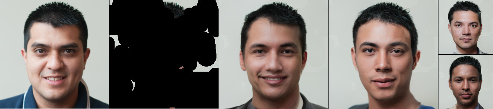

# Repository for [Conditional Image Generation by Conditioning Variational Auto-Encoders](https://openreview.net/forum?id=7MV6uLzOChW), ICLR 2022

<p float="left">

</p>

Based on the code (and pretrained models) released by [Child et al. (2020)](https://arxiv.org/abs/2011.10650) at https://github.com/openai/vdvae/. Please open an issue or email <wsgh@cs.ubc.ca> if you have any questions/requests

## Python requirements
We used Python 3.8.10. See `requirements.txt` for the required packages (which can be installed with pip using `pip install -r requirements.txt`). For training on multiple GPUs, `mpi4py` is required as well. VQ-VAE and CoModGAN baselines are implemented in Tensorflow. If you wish to run these baselines you will also need to install `tensorflow-gpu==1.15.0`.

## Data
Download and preprocess each dataset by running the corresponding script, named as `setup_<dataset name>.sh`.

## Pretrained (conditional) IPA models
We also provide a trained IPA model for each dataset. You can download these checkpoints [here](https://drive.google.com/drive/folders/1h899kAZbypGyRf1djWAiWytU0YHz7190?usp=sharing). These are trained for the time and number of iterations reported in Table 3 of [the paper](https://openreview.net/forum?id=7MV6uLzOChW).

## Example sampling commands
We provide an example sampling script `sample.py` which can be used with IPA checkpoints either downloaded with the link above or trained locally. To use it, download a pretrained `model-ema.th` checkpoint (e.g. for CIFAR-10, make a directory `ipa/downloads/cifar10-ipa` then download `cifar10-ipa/model-ema.th` from [the link above](https://drive.google.com/drive/folders/1h899kAZbypGyRf1djWAiWytU0YHz7190?usp=sharing) and save it at `ipa/downloads/cifar10-ipa/model-ema.th`. Then run the following on a device with a GPU:
```
NO_MPI=1 python sample.py --hps cifar10 --ckpt_load_dir downloads/cifar10-ipa/
```
which will save samples in `ipa/samples/`. Or, e.g., for FFHQ-256 download the appropriate checkpoint and then run:
```
NO_MPI=1 python sample.py --hps ffhq256 --ckpt_load_dir <PATH TO FFHQ256 CHECKPOINT>
```
This script is written to generate the bottom half of an image conditioned on the top half. To condition in different ways, edit the mask created in lines 20-22 of `sample.py`.

## Pretrained (unconditional) VD-VAEs
Most of our experiments use VD-VAEs trained by [Child et al. (2020)](https://arxiv.org/abs/2011.10650). You can download these unconditional VAE chekpoints by running `bash download-pretrained.sh`. Feel free to comment out the lines downloading non-required checkpoints.

## Example training commands
We prefix all shown commands with `NO_MPI=1`, which sets the environment variable to prevent the script importing `mpi4py` or using distributed training. To train on multiple GPUs, you should install `mpi4py` and execute the command using, e.g., `mpiexec`.

### CIFAR-10
```
NO_MPI=1 python train.py --hps=cifar10 --lr=0.0002 --n_batch=30 --pretrained_load_dir=pretrained/cifar10-1/
```

### ImageNet-64
```
NO_MPI=1 python train.py --hps=imagenet64 --lr=5e-05 --n_batch=4 --pretrained_load_dir=pretrained/imagenet64/
```

### FFHQ-256
```
NO_MPI=1 python train.py --hps=ffhq256 --lr=0.00015 --n_batch=1 --pretrained_load_dir=pretrained/ffhq256/
```

## Logging to https://wandb.ai/
Our code logs to the Weights & Biases experiment-tracking infrastructure. To use it, you should create an account at https://wandb.ai/ and set the environment variable `WANDB_ENTITY` to your username (e.g. by running `export WANDB_ENTITY=<your username>`). To avoid logging to wandb, e.g. to avoid having to create an account, add the flag `--unobserve` to your training command.


## Citation
```
@inproceedings{
harvey2022conditional,
title={Conditional Image Generation by Conditioning Variational Auto-Encoders},
author={William Harvey and Saeid Naderiparizi and Frank Wood},
booktitle={International Conference on Learning Representations},
year={2022},
url={https://openreview.net/forum?id=7MV6uLzOChW}
}
```
