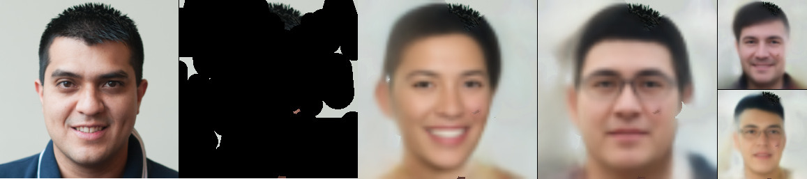

# ANP baseline

This implementation is based on and highly borrowing from these two repos:
- https://github.com/EmilienDupont/neural-processes
- https://github.com/YannDubs/Neural-Process-Family

<p float="left">

</p>

## Training the models

CIFAR-10

```
python train.py --dataset ffhq256
```

FFHQ-256

```
python train.py --dataset cifar10
```
