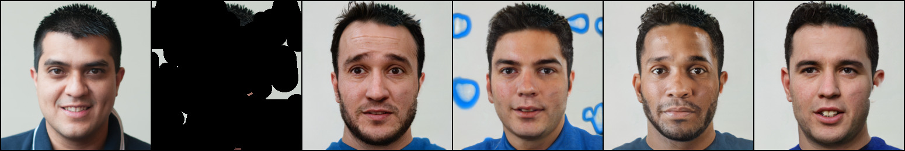

# CoModGAN baseline

Code taken from https://github.com/zsyzzsoft/co-mod-gan



## Training the models

CIFAR-10

```
python run_training.py --dataset cifar10 --mirror_augment True --num_gpus 2 --total_kimg 25000 --num_workers 8
```

FFHQ-256

```
python run_training.py --dataset ffhq256 --mirror_augment True --num_gpus 4 --total_kimg 25000 --num_workers 8
```

ImageNet-64
```
python run_training.py --dataset imagenet64 --mirror_augment True --num_gpus 4 --total_kimg 25000 --num_workers 8 --batch_gpu 8
```
