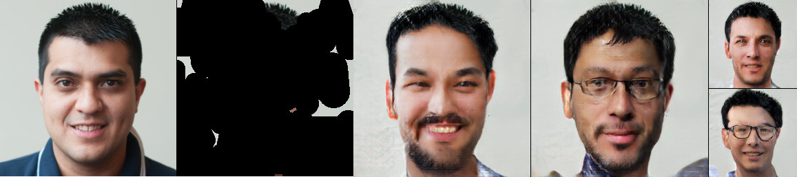

# PIC baseline

Code taken from https://github.com/lyndonzheng/Pluralistic-Inpainting

<p float="left">

</p>

## Training the models

CIFAR-10

```
python train.py --dataset=cifar10 --niter 1800000
```

FFHQ-256

```
python train.py --dataset=ffhq256 --niter 2100000
```

ImageNet-64
```
python train.py --dataset=imagenet64 --niter 990000
```
