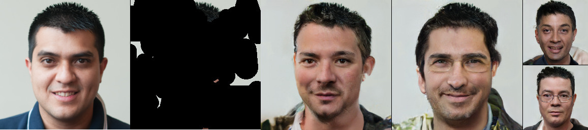

# VQ-VAE baseline

Code taken from https://github.com/USTC-JialunPeng/Diverse-Structure-Inpainting

<p float="left">

</p>

## Training the models

Training for this baseline involves training three different modules: a VQ-VAE, a structure generator and a texture generator. This requires running three different training scripts for each dataset.

CIFAR-10

1. Training the VQ-VAE:

    ```
    python train_vqvae.py --dataset cifar10 --max_steps 1000000
    ```

2. Training the structure generator:

    ```
    python train_structure_generator.py --dataset cifar10 --max_steps 1000000 --vqvae_network_dir <path-to-model-checkpoint-directory-from-step1>
    ```
    
3. Training the texture generator:

    ```
    python train_texture_generator.py --dataset cifar10 --max_steps 2000000 --vqvae_network_dir <path-to-model-checkpoint-directory-from-step1>
    ```

FFHQ-256

1. Training the VQ-VAE:

    ```
    python train_vqvae.py --dataset ffhq256 --max_steps 1000000
    ```

2. Training the structure generator:

    ```
    python train_structure_generator.py --dataset ffhq256 --max_steps 1000000 --vqvae_network_dir <path-to-model-checkpoint-directory-from-step1>
    ```
    
3. Training the texture generator:

    ```
    python train_texture_generator.py --dataset ffhq256 --max_steps 2000000 --vqvae_network_dir <path-to-model-checkpoint-directory-from-step1>
    ```
